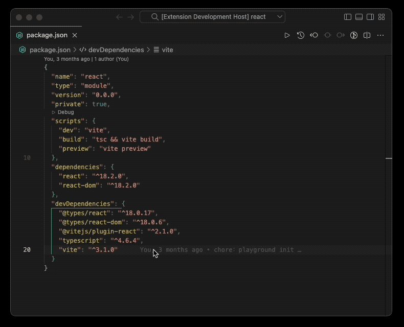

<em>Pkg Auto Install for VS Code</em>
<h1 align="center">
  
</h1>

English | [`中文`](./README_ZH.md)

## Introduction

Automatically execute the `install` command, no need to manually open the command line operation

## Features

- Automatically `install` after modification in package.json file
- Support monorepo

## Effect

